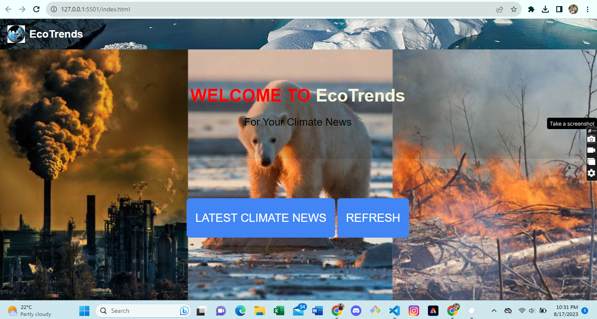

# EcoTrends - Latest Climate News

EcoTrends is a web application that provides users with the latest climate news from trusted sources, such as NASA and UN. Stay informed about climate-related developments and issues with just a click.

## Screenshot

## Description

EcoTrends is a web application built to keep users updated with the latest climate news. It fetches news articles from various trusted sources related to climate and environment. Users can easily access news articles, read more about each topic, and stay informed about ongoing environmental discussions.

## Features

- Fetch and display the latest climate news articles.
- Click on an article to read more about it.
- Refresh button to reload the page and fetch new articles.
- Responsive design for optimal viewing on various devices.

## Usage

1. Upon opening the web application, you'll see a header with the name "EcoTrends" and a refresh button on the right.
2. Scroll down to the "Welcome to EcoTrends" section to learn more about the application.
3. Click the "LATEST CLIMATE NEWS" button to fetch and display the latest climate news articles.
4. Click on a news article to read the full story on the source's website.
5. Use the refresh button to fetch new articles whenever you like.

## API Credits

This project uses the [Climate News Feed API](https://climate-news-feed.p.rapidapi.com) to fetch the latest climate news articles. We would like to express our gratitude to the API developers for providing this valuable service.

## Contributing

Contributions are welcome! If you find any issues or have suggestions for improvement, feel free to submit a pull request or open an issue.

## License

This project is licensed under the MIT License - see the [LICENSE](LICENSE) file for details.

---

By [SADICK]
